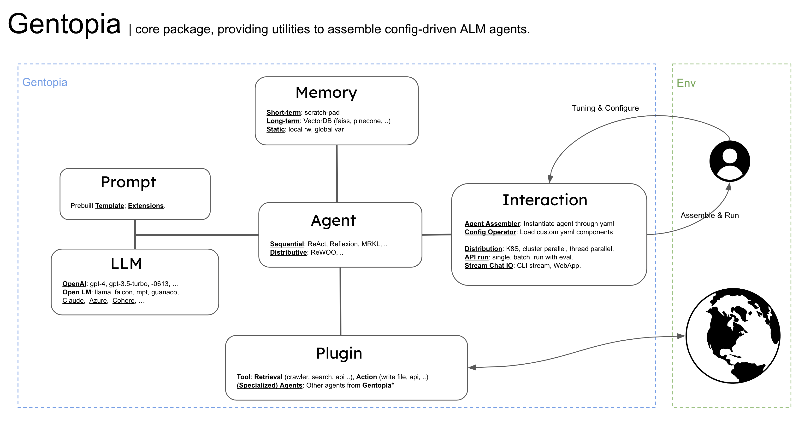

# Introduction

## Gentopia

Gentopia is a lightweight and extensible framework for LLM driven autonomous Agent.
It provides multiple essential components to build, test and evaluate config-driven agents. 
At its core, Gentopia aims to embody agents with single config files, thus minimizing your effort in maintaining, tuning and sharing agents.

Gentopia maintains a pool ([GentPool](https://github.com/Gentopia-AI/GentPool)) to share public agents specialized for different tasks.
In this platform, one could easily refer to other agents for interaction, extend and optimize components tailored to your own needs.
You can also publish your specialized agent to get our unique benchmark eval 

UltiCollective Growth agent specialization and interaction.



## Section One

This section describes how to do something.

### Subsection One

More details can be provided here. For example:

- Point one
- Point two
- Point three

## Section Two

This section describes something else.

Here is an example of how to display code:

```python
def hello_world():
    print("Hello, world!")
